# 🧠 Polymath World

> A structured second brain for people with too many interests — powered by Claude, built on PARA, inspired by Karpathy's LLM Wiki.

```bash
npx polymath-world
```

One command scaffolds your entire knowledge system: folder structure, Claude schema, skill files, and daily workflow — ready to use in under 60 seconds.



> 🆕 **Never used a terminal before?** Read the [complete beginner setup guide](docs/getting-started.md) — covers everything from installing Node.js to your first ingest, step by step.

---

## The Problem

You read everything. You save everything. You connect nothing.

Papers, articles, podcasts, half-finished projects, ideas at 2am — scattered across Notion, Apple Notes, browser bookmarks, and a Downloads folder you haven't opened in months.

The issue isn't that you consume too much. It's that your system doesn't grow with you.

---

## The Stack

This system combines three proven approaches into one installable package:

### 1. PARA by [Tiago Forte](https://fortelabs.com/)
**Projects · Areas · Resources · Archives** — four folders that cover everything. Simple, durable, battle-tested.

- **1 - Projects** → active work with a deadline
- **2 - Areas** → ongoing responsibilities (health, finance, relationships, skills)
- **3 - Resources** → raw clips, saved articles, reference material
- **4 - Archives** → completed projects and inactive areas

### 2. LLM Wiki by [Andrej Karpathy](https://x.com/karpathy)
Karpathy proposed using an LLM not as a chatbot, but as a **persistent knowledge maintainer** — something that reads your notes, writes structured pages, resolves contradictions, and keeps a living index of everything you know.

That's exactly what `CLAUDE.md` does here. Claude doesn't answer questions and forget. Claude maintains the wiki.

### 3. Caveman by [Julius](https://github.com/juliuslipp/claude-caveman)
A Claude Code skill that compresses output tokens by 65–75% using terse, minimal language for conversational messages — while keeping wiki page content clean and readable.

Result: faster responses, lower API costs, zero quality loss on the stuff that matters.

---

## How It Works

```
Your sources (articles, PDFs, notes, web clips)
        ↓
   Claude reads + classifies
        ↓
   Structured wiki pages (entity, concept, synthesis)
        ↓
   Cross-referenced, linked, indexed
        ↓
   Living knowledge base that grows with you
```

Claude acts as your wiki maintainer — not a chatbot. You drop a source, Claude:

1. Asks one classification question (project or area?)
2. Extracts key takeaways
3. Writes structured wiki pages
4. Cross-references existing knowledge
5. Updates the master index and activity log

No manual tagging. No reformatting. No copy-pasting.

---

## Quick Start

### Requirements

| Tool | What it is | Install |
|------|-----------|---------|
| [Obsidian](https://obsidian.md/) | Note-taking app — your vault lives here | Free download |
| [Node.js 18+](https://nodejs.org/) | Needed to run the `npx` command below | Free — grab the LTS version |
| [Claude Code](https://claude.ai/code) | Anthropic's AI assistant that runs in your terminal — **different from claude.ai** | ~$0.01–0.05/day (API usage, no subscription) |

> New to any of these? The [Getting Started guide](docs/getting-started.md) walks through installing each one.

### Install

**1. Open your terminal**
- **Windows:** Press the Windows key → type `Terminal` → press Enter
- **Mac:** Press Cmd+Space → type `Terminal` → press Enter

**2. Navigate to where you want your vault** (e.g. your Documents folder):
```bash
# Windows
cd Documents

# Mac / Linux
cd ~/Documents
```

**3. Run the installer:**
```bash
npx polymath-world
```

The CLI will ask you:
1. Where to create your vault
2. What areas you want to start with (e.g. Learning, Health, Finance, Work)
3. Whether to install the caveman skill for token compression

**4. Open the vault in Obsidian:** File → Open folder as vault → select the folder just created.

**5. Start Claude Code inside the vault:**
```bash
cd my-vault   # use the name you chose
claude
```

Claude will read `CLAUDE.md` and confirm it's ready. You're set.

---

### Prefer no terminal?

If you'd rather skip the command line entirely, use the **"Use this template"** button at the top of this repo. It creates a copy of the vault structure directly on GitHub — you can then download or clone it, open it in Obsidian, and start from Step 5 above.

---

## The Workflow

> All workflow commands below are typed inside your **Claude Code session** — the terminal window where you ran `claude` from inside your vault folder.

### Daily Ingest
Drop a source file into `3 - Resources/` inside your vault, then say:

```
ingest [filename or URL]
```

Claude classifies it, writes the summary page, updates linked concept pages, and logs the activity. You review, not rewrite.

### Daily Notes
Your daily notes stay as-is — no forcing them through the ingest pipeline. Claude reads them, extracts cross-area insights, and routes those insights to the relevant synthesis pages.

### Querying
Ask anything against your wiki:

```
What do I know about habit formation?
```

Claude reads the index, pulls the relevant pages, and synthesises an answer with citations to your own notes.

### Lint Pass
Run periodically to keep the wiki healthy:

```
lint the wiki
```

Claude surfaces: orphaned pages, dangling links, unanswered open questions, stale synthesis pages, people mentioned across multiple pages who lack their own page.

---

## Vault Structure

```
Your Vault/
├── CLAUDE.md                    ← The operating schema (Claude reads this every session)
│
├── 0 - Wiki/
│   ├── index.md                 ← Master catalog of all wiki pages
│   └── log.md                   ← Append-only activity log
│
├── 1 - Projects/                ← Active work with a defined outcome + deadline
│   └── [Project Name]/
│       ├── _synthesis.md        ← Living synthesis maintained by Claude
│       └── [wiki pages]
│
├── 2 - Areas/                   ← Ongoing responsibilities, no end date
│   └── [Area Name]/
│       ├── _synthesis.md
│       └── [wiki pages]
│
├── 3 - Resources/               ← Raw sources: web clips, PDFs, notes (READ ONLY)
│
├── 4 - Archives/                ← Completed projects, inactive areas (READ ONLY)
│
└── 5 - Attachments/             ← Binary files: PDFs, images (READ ONLY)
```

---

## Page Types

| Type | Purpose | Lives in |
|------|---------|---------|
| `entity` | A person, place, product, organisation | Projects or Areas |
| `concept` | An idea, framework, method | Projects or Areas |
| `synthesis` | Living summary of a Project or Area | Root of each folder |
| `summary` | Digest of a single source | Same folder as pages it feeds |
| `person` | Any significant person across sources | `2 - Areas/People/` |

---

## Token Efficiency

With caveman installed, Claude uses compressed language for all conversational output. A typical ingest session that would use 4,000 tokens uses ~1,200 instead.

Wiki page content is always written normally — compression never touches the vault files.

---

## Philosophy

Most second brain systems fail because they require constant manual maintenance. You end up maintaining the system instead of using it.

Polymath World flips that. Claude does the maintenance. You do the thinking.

The vault is a tool for polymaths — people who follow curiosity across domains, connect ideas from different fields, and build knowledge that compounds over time. The system is designed to grow with you for years, not months.

---

## Credits

- **PARA Method** — [Tiago Forte](https://fortelabs.com/) — the foundational organising structure
- **LLM Wiki concept** — [Andrej Karpathy](https://x.com/karpathy) — the philosophy of LLM-as-wiki-maintainer
- **Caveman** — [Julius](https://github.com/juliuslipp/claude-caveman) — token compression for Claude Code
- **Obsidian** — [Obsidian.md](https://obsidian.md/) — the local-first knowledge base that makes the graph possible

---

## Documentation

- [Getting Started](docs/getting-started.md) — complete beginner guide: install everything, run the CLI, open your vault, start your first session
- [Ingest Guide](docs/ingest-guide.md) — step-by-step: turning any source into structured wiki pages
- [Daily Notes](docs/daily-notes.md) — how daily notes are handled differently (no summary page)
- [FAQ](docs/faq.md) — setup, workflow, token efficiency, philosophy
- [Publishing to npm](docs/publishing.md) — how to publish your own fork or contribute a release

---

## Contributing

PRs welcome. Open an issue if something breaks or you want to propose a new workflow pattern.

---

## License

MIT — use it, fork it, build on it.

---

_Built by [@hi7anshu](https://github.com/hi7anshu/polymath-vault) · Star this if it's useful · Share it with someone who has too many tabs open_
